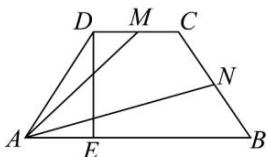

> [!faq]- 全练一本通解析
> **【答案】** 详见解析
>
> **【解析】**
> （1） $\overrightarrow{AM} = \frac{1}{6}\vec{a} +\vec{b},\overrightarrow{AN} = \frac{2}{3}\vec{a} +\frac{1}{2}\vec{b};$ （2） $\frac{17}{4}$
> 详解：（1） $\overrightarrow{AM} = \overrightarrow{AD} +\overrightarrow{DM} = \overrightarrow{AD} +\frac{1}{2}\overrightarrow{DC} = \overrightarrow{AD} +\frac{1}{6}\overrightarrow{AB} = \frac{1}{6}\vec{a} +\vec{b},$
> $$
> \overrightarrow {A N} = \overrightarrow {A B} + \overrightarrow {B N} = \overrightarrow {A B} + \frac {1}{2} \overrightarrow {B C} = \overrightarrow {A B} + \frac {1}{2} (\overrightarrow {B A} + \overrightarrow {A D} + \overrightarrow {D C})
> $$
> $$
> = \frac {2}{3} \overrightarrow {A B} + \frac {1}{2} \overrightarrow {A D} = \frac {2}{3} \vec {a} + \frac {1}{2} \vec {b}
> $$
> （2）由题意可得 $|DC|=1$ ，过D作AB的垂线DE，则由
> $$
> \angle D A E = 4 5 ^ {\circ} \Rightarrow | D E | = | A E | = \frac {1}{2} (| A B | - | D C |) = 1
> $$
> 
> $\therefore \left|\vec{b}\right| = \sqrt{2},\vec{a}\cdot \vec{b} = 3\times \sqrt{2}\times \cos 45^{\circ} = 3,$
> $$
> \therefore \overrightarrow {A M} \cdot \overrightarrow {A N} = \left(\frac {1}{6} \vec {a} + \vec {b}\right) \left(\frac {2}{3} \vec {a} + \frac {1}{2} \vec {b}\right) = \frac {1}{9} \vec {a} ^ {2} + \frac {3}{4} \vec {a} \cdot \vec {b} + \frac {1}{2} \vec {b} ^ {2} = \frac {1 7}{4}
> $$
