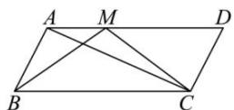

<!-- question-source:start -->
【30】(2023·陕西安康高三校联考)如图,在平行四边形ABCD中, $\overrightarrow{AM}=\frac{1}{3}\overrightarrow{AD}$ ,令 $\overrightarrow{AB}=\overrightarrow{a},\overrightarrow{AC}=\overrightarrow{b}$ .

（1）用 $\vec{a},\vec{b}$ 表示 $\overrightarrow{AM},\overrightarrow{BM},\overrightarrow{CM}$ ;

(2) 若 AB = AM = 2， $\overrightarrow{AC} \cdot \overrightarrow{BM} = 10$ ，求 $\cos\left\langle\vec{a},\vec{b}\right\rangle$

<!-- question-source:end -->

![[Q00009236A1]]
