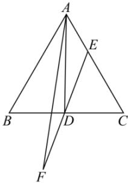

<!-- question-source:start -->
【68】（2023·江苏南通高一统考阶段练习）等边三角形 $\triangle ABC$ ，边长为 $2, D$ 为 $BC$ 的中点，动点 $E$ 在边 $AC$ 上， $E$ 关于 $D$ 的对称点为 $F$ ：

(1) 若 E 为 AC 的中点, 求 $\overrightarrow{AD} \cdot \overrightarrow{BE}$ .

(2) 求 $\overrightarrow{AE} \cdot \overrightarrow{AF}$ 的取值范围.
<!-- question-source:end -->

![[Q00009274A1]]
