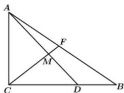

<!-- question-source:start -->
【69】(2022·浙江高一校考期末)在三角形 ABC 中, $AB=2,AC=1,\angle ACD=\frac{\pi}{2},D$ 是线段 BC 上一点,且 $\overrightarrow{BD}=\frac{1}{2}\overrightarrow{DC},F$ 为线段 AB 上一点.
（1）若 $\overrightarrow{AD}=x\overrightarrow{AB}+y\overrightarrow{AC}$ ，求 x-y 的值；
（2）求 $\overrightarrow{CF} \cdot \overrightarrow{FA}$ 的取值范围；

<!-- question-source:end -->

![[Q00009275A1]]
