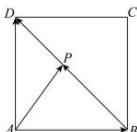

> [!faq]- 全练一本通解析
> **【答案】** C
>
> **【解析】**
> 解析：设 $\overrightarrow{BP} = \lambda \overrightarrow{BD}$ ，则 $0 \leqslant \lambda \leqslant 1$ ， $\overrightarrow{AP} = \overrightarrow{AB} + \overrightarrow{BP} = \overrightarrow{AB} + \lambda \overrightarrow{BD} = \overrightarrow{AB} + \lambda (\overrightarrow{AD} - \overrightarrow{AB}) = (1 - \lambda) \overrightarrow{AB} + \lambda \overrightarrow{AD}$ , $\overrightarrow{BD} = \overrightarrow{AD} - \overrightarrow{AB}$ ,
> 所以 $\overrightarrow{AP} \cdot \overrightarrow{BD} = [ (1 - \lambda) \overrightarrow{AB} + \lambda \overrightarrow{AD}] \cdot (\overrightarrow{AD} - \overrightarrow{AB})$ ，
> 又 $|\overrightarrow{AD}| = |\overrightarrow{AB}| = 1, \overrightarrow{AB} \cdot \overrightarrow{AD} = 0$ ，
> 所以 $\overrightarrow{AP} \cdot \overrightarrow{BD} = -(1 - \lambda) + \lambda = 2\lambda - 1$ ，又 $0 \leqslant \lambda \leqslant 1$ ，
> 所以 $\overrightarrow{AP} \cdot \overrightarrow{BD} \in [-1, 1]$ . 故选：C.
> 
