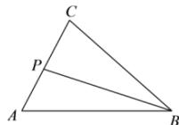

> [!faq]- 全练一本通解析
> **【答案】** $\left[-\frac{1}{16},3\right]$
>
> **【解析】**
> 设 $\overrightarrow{PC}=m\overrightarrow{AC}$ ， $0\leq m\leq1$ ，则 $\overrightarrow{PB}=\overrightarrow{PA}+\overrightarrow{AB}=(m-1)\overrightarrow{AC}+\overrightarrow{AB}$ ，故 $\overrightarrow{PB}\cdot\overrightarrow{PC}=\left[(m-1)\overrightarrow{AC}+\overrightarrow{AB}\right]\cdot m\overrightarrow{AC}=m(m-1)\overrightarrow{AC}^{2}+m\overrightarrow{AB}\cdot\overrightarrow{AC}$ $=4m(m-1)+m\left|\overrightarrow{AB}\right|\cdot\left|\overrightarrow{AC}\right|\cos\angle BAC=4m^{2}-4m+3m$ $=4m^{2}-m=4\left(m-\frac{1}{8}\right)^{2}-\frac{1}{16}$
> 
> 因为 $0 \leq m \leq 1$ ，所以 $-\frac{1}{8} \leq m - \frac{1}{8} \leq \frac{7}{8}$ ，
> $$
> - \frac {1}{1 6} \leq 4 \left(m - \frac {1}{8}\right) ^ {2} - \frac {1}{1 6} \leq 3, \overrightarrow {P B} \cdot \overrightarrow {P C} \in \left[ - \frac {1}{1 6}, 3 \right].
> $$
> $$
> \left[ - \frac {1}{1 6}, 3 \right]
> $$
