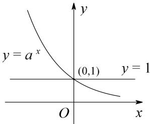
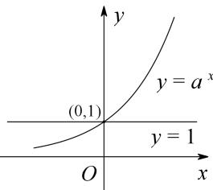

## 2. 指数函数的图象和性质

一般地, 指数函数 $y = a^{x}$ （a > 0，且 $a \neq 1$ ）的图象和性质如下表所示:

<table><tr><td></td><td>0 &lt; a &lt; 1</td><td>a &gt; 1</td></tr><tr><td>图象</td><td></td><td></td></tr><tr><td>定义域</td><td colspan="2">R</td></tr><tr><td>值域</td><td colspan="2">(0, +∞)</td></tr><tr><td rowspan="2">性质</td><td colspan="2">过定点(0,1),即x=0时,y=1</td></tr><tr><td>在R上是减函数</td><td>在R上是增函数</td></tr><tr><td>对称性</td><td colspan="2">函数 $y = a^x$ 与 $y = \left(\frac{1}{a}\right)^x$ 的图象关于y轴对称</td></tr></table>
