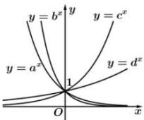

<!-- question-source:start -->
【13】函数① $y=a^{x}$ ; ② $y=b^{x}$ ; ③ $y=c^{x}$ ; ④ $y=d^{x}$ 的图象如图所示, a, b, c, d 分别是下列四个数: $\frac{5}{4}$ , $\sqrt{3}$ , $\frac{1}{3}$ , $\frac{1}{2}$ 中的一个, 则 a, b, c, d 的值分别是（）

A. $\frac{5}{4},\sqrt{3},\frac{1}{3},\frac{1}{2}$ B. $\sqrt{3},\frac{5}{4},\frac{1}{2},\frac{1}{3}$ C. $\frac{1}{2},\frac{1}{3},\sqrt{3},\frac{5}{4}$ D. $\frac{1}{3},\frac{1}{2},\frac{5}{4},\sqrt{3}$
<!-- question-source:end -->

![[Q00010286A1]]
