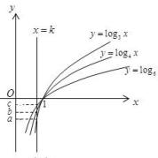
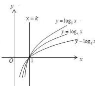
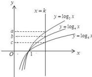

> [!faq]- 全练一本通解析
>
> > [!success]- **【答案】** （1）答案见解析；（2）证明见解析
>
> > [!note]- **【分析】**
> > 本题未单列分析。
>
> > [!note]- **【解析】**
> > （1）设 $3^{a}=4^{b}=6^{c}=k$ ，可得 $a=\log_{3}k, b=\log_{4}k, c=\log_{6}k$ ，其中 k>0，
> > 在同一坐标系中，分别作出 $y=\log_{3}x, y=\log_{4}x, y=\log_{6}x$ 和 y=k 的图象，当 0<k<1 时，如图图（1）所示，可得 a<b<c<0；
> > 当 k=1 时，如图图（2）所示，可得 a=b=c=0；
> > 当 k>1 时，如图图（3）所示，可得 a>b>c>0。
> > 
> > 
> > (1)
> > 
> > (2)
> > (3)
> > （2）设 $3^{a} = 4^{b} = 6^{c} = k$ ，可得 $a = \log_3k, b = \log_4k, c = \log_6k$ ，其中 $k > 0$ ， $\frac{2}{c} = \frac{2}{\log_6k} = \frac{2\lg 6}{\lg k} = \frac{\lg 36}{\lg k}$ ， $\frac{2}{a} + \frac{1}{b} = \frac{2}{\log_3k} + \frac{1}{\log_4k} = \frac{2\lg 3}{\lg k} + \frac{\lg 3}{\lg k} = \frac{\lg 36}{\lg k}$ ，所以 $\frac{2}{c} = \frac{2}{a} + \frac{1}{b}$ .
