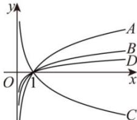

<!-- question-source:start -->
【12】（2023·全国高一随堂练习）如图，A, B, C, D 是 $y = \lg x$ , $y = \log_{4} x$ , $y = \log_{2} x$ , $y = \log_{\frac{1}{2}} x$ 四个函数的图象，则

（1）函数 $y = \lg x$ 的图象是 \_\_\_\_；

(2) 函数 $y = \log_{4} x$ 的图象是 \_\_\_\_;

（3）函数 $y=\log_{2}x$ 的图象是 \_\_\_\_；

（4）函数 $y=\log_{\frac{1}{2}}x$ 的图象是 \_\_\_\_.
<!-- question-source:end -->

![[Q00010387A1]]
