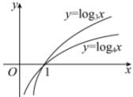
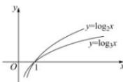
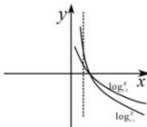
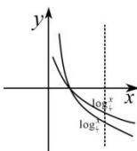

> [!faq]- 全练一本通解析
>
> > [!success]- **【答案】** （1） $\log_3 0.2 < \log_4 0.2$ ；（2） $\log_2 5 > \log_3 5$ ；（3） $\log_{0.04} 0.64 < \log_{0.3} 0.8$ ；（4） $\frac{\log_1}{2} \sqrt{3} < \frac{\log_1}{5} 3$ 。
>
> > [!note]- **【分析】**
> > 本题未单列分析。
>
> > [!note]- **【解析】**
> > （1）作出 $y = \log_3x$ 和 $y = \log_4x$ 的图象如下图.
> > 
> > 由图象知 $\log_30.2 < \log_40.2$
> > （2）函数 $y = \log_2 x$ 和 $y = \log_3 x$ 的图象如图所示. 当 $x > 1$ 时， $y = \log_2 x$ 的图象在 $y = \log_3 x$ 的图象的上方，所以 $\log_2 5 > \log_3 5$ .
> > 
> > （3）利用公式可得
> > $\log_{0.04} 0.64 = \log_{0.04} 0.8^2 = 2\log_{0.04} 0.8 = \frac{1}{0.5}\log_{0.04} 0.8 = \log_{0.2} 0.8$ 函数 $\log_{0.2} 0.8$ 和 $\log_{0.3} 0.8$ 的图象如图所示. 当 $x = 0.8$ 时， $y = \log_{0.2} 0.8$ 的图象在 $y = \log_{0.3} 0.8$ 的图象的下方，所以 $\log_{0.2} 0.8 < \log_{0.3} 0.8$ ，即 $\log_{0.04} 0.64 < \log_{0.3} 0.8$ .
> > 
> > （4）利用公式可得 $\log_{\frac{1}{2}}\sqrt{3} = \frac{1}{2}\log_{\frac{1}{2}}3 = \log_{\frac{1}{4}}3$ 函数 $\frac{\log_13}{4}$ 与 $\frac{\log_13}{5}$ 的图象如图所示.当 $x = 3$ 时， $y = \log_{\frac{1}{4}}3$ 的图象在 $y = \log_{\frac{1}{5}}3$ 的图象的下方，所以 $\frac{\log_13 <   \log_{\frac{1}{5}}3}{4}$ ，即 $\frac{\log_1\sqrt{3} <  \log_{\frac{1}{5}}3}{2}$
> > 
