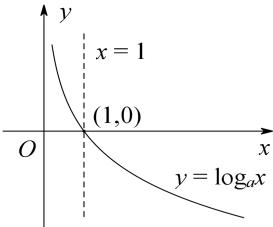
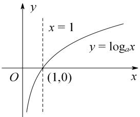

## 4. 对数函数的图象和性质

<table><tr><td></td><td>0 &lt; a &lt; 1</td><td>a &gt; 1</td></tr><tr><td>图象</td><td></td><td></td></tr><tr><td>定义域</td><td colspan="2">(0, +∞)</td></tr><tr><td>值域</td><td colspan="2">R</td></tr><tr><td rowspan="2">性质</td><td colspan="2">过定点 (1,0), 即当 x = 1 时, y = 0.</td></tr><tr><td>减函数</td><td>增函数</td></tr><tr><td>对称性</td><td colspan="2">函数  $y = \log_a x$  与  $y = \log_{\frac{1}{a}} x$  的图象关于 x 轴对称</td></tr></table>
