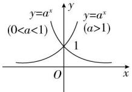
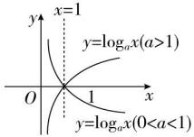

## 1. 指数函数与对数函数的比较

<table><tr><td>名称</td><td>指数函数</td><td>对数函数</td></tr><tr><td>一般形式</td><td> $y = a^{x}$ (a&gt;0,且a≠1)</td><td> $y = \log_{a} x$ (a&gt;0,且a≠1)</td></tr><tr><td>图象</td><td></td><td></td></tr><tr><td>定义域</td><td>(-∞,+∞)</td><td>(0,+∞)</td></tr><tr><td>值域</td><td>(0,+∞)</td><td>(-∞,+∞)</td></tr><tr><td>单调性</td><td>当a&gt;1时,y=a $^{x}$ 为增函数;当0&lt; a&lt; 1时,y=a $^{x}$ 为减函数</td><td>当a&gt;1时,y= $\log_{a} x$ 为增函数;当0&lt; a&lt; 1时,y= $\log_{a} x$ 为减函数</td></tr></table>
