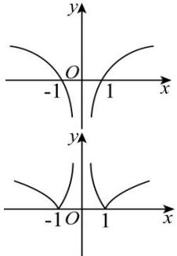
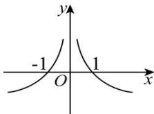
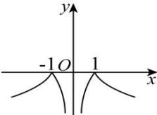

<!-- question-source:start -->
【19】（2023·湖南）若函数 $y = a^{|x|} (a > 0 \text{ 且 } a \neq 1)$ 的值域为 $[1, +\infty)$ ，则函数 $y = \log_{a} |x|$ 的大致图象是（）

A.
C.

B.
D.

<!-- question-source:end -->

![[Q00014038A1]]
