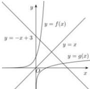
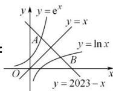

> [!faq]- 全练一本通解析
>
> > [!success]- **【答案】** A
>
> > [!note]- **【分析】**
> > 本题未单列分析。
>
> > [!note]- **【解析】**
> > 3
> > 解析: 将已知的两个方程变形得 $\lg x = -x + 3$ , $10^{x} = -x + 3$ .
> > 令： $f(x)=\lg x,\quad g(x)=10^{x},\quad h(x)=3-x$ ，画出它们的图像，如图，
> > 
> > 记函数 $f(x) = \lg x$ 与 $h(x) = 3 - x$ 的交点为 $A(x_{1},y_{1})$ ， $g(x) = 10^{x}$ 与 $h(x) = 3 - x$ 的图像的交点为 $B(x_{2},y_{2})$ ，由于 $f(x) = \lg x$ 与 $g(x) = 10^{x}$ 互为反函数，且直线 $y = 3 - x$ 与直线 $y = x$ 垂直，所以 $A(x_{1},y_{1})$ 与 $B(x_{2},y_{2})$ 两点关于直线 $y = x$ 对称，由 $\left\{ \begin{array}{l} y = x \\ y = -x + 3 \end{array} \right.$ ，解得 $\left\{ \begin{array}{l} x = \frac{3}{2} \\ y = \frac{3}{2} \end{array} \right.$ ， $\therefore \frac{x_1 + x_2}{2} = \frac{3}{2}$ ，则 $x_{1} + x_{2} = 3$ 。
> > 
> > 解析：
> > $e^{x}+x-2023=0\Rightarrow e^{x}=2023-x$ ，等价于等价于 $y=e^{x}$ 与y=2023-x的图像的交点，由题意可得 $x_{1}$ 是函数 $y=e^{x}$ 的图像与直线 $y=-x+2023$ 交点A的横坐标， $x_{2}$ 是函数 $y=\ln x$ 图像与直线 $y=-x+2023$ 交点B的横坐标，
> > 因为 $y=e^{x}$ 的图像与 $y=\ln x$ 图像关于直线y=x对称，而直线 $y=-x+2023$ 也关于直线y=x对称，
> > 所以线段AB的中点就是直线 $y=-x+2023$ 与y=x的交点，
> > 由 $\left\{\begin{aligned}y&=x\\ y&=-x+2023\end{aligned}\right.$ ，得 $\left\{\begin{aligned}x&=\frac{2023}{2}\\ y&=\frac{2023}{2}\end{aligned}\right.$ ，即线段AB的中点为 $\left(\frac{2023}{2},\frac{2023}{2}\right)$ ，
> > 所以 $\frac{x_{1}+x_{2}}{2}=\frac{2023}{2}$ ．
> >
> > 故选 **A**
