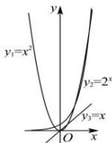

> [!faq]- 全练一本通解析
>
> > [!success]- **【答案】** BD
>
> > [!note]- **【分析】**
> > 本题未单列分析。
>
> > [!note]- **【解析】**
> > 解析: 如图对于 $y_{1}=x^{2}, y_{2}=2^{x}$ ，从负无穷开始， $y_{1}$ 大于 $y_{2}$ ，然后 $y_{2}$ 大于 $y_{1}$ ，再然后 $y_{1}$ 再次大于 $y_{2}$ ，最后 $y_{2}$ 大于 $y_{1}, y_{1}$ 再也追不上 $y_{2}$ ，故随着 x 的逐渐增大，
> > $y_{2}$ 增长速度越来越快于 $y_{1}$ ，A 错误，BD 正确；
> > $y_{1}=x^{2},y_{3}=x$ 由于 $y_{3}=x$ 的增长速度是不变的, 当 $x\in(0,1)$ 时, $y_{3}$ 大于 $y_{1}$ ,
> > 当 $x \in (1, +\infty)$ 时， $y_{1}$ 大于 $y_{3}$ ， $y_{3}$ 再也追不上 $y_{1}$ ， $y_{1}$ 增长速度有时快于 $y_{3}$ ，C 错误.
> > 故选:BD.
> > 
