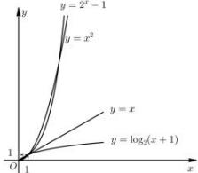

> [!faq]- 全练一本通解析
>
> > [!success]- **【答案】** ③④⑤
>
> > [!note]- **【分析】**
> > 本题未单列分析。
>
> > [!note]- **【解析】**
> > $f_{1}(x)=2^{x}-1$ ， $f_{2}(x)=x^{2}$ ， $f_{3}(x)=x$ ， $f_{4}(x)=\log_{2}(x+1)$ ，它们相应的函数模型分别是指数型函数，二次函数，一次函数，和对数型函数模型，函数图像如图：
> > 
> > 当 x=2 时， $f_{1}(2)=3, f_{2}(2)=4$ ，∴命题①不正确；
> > 当 x=5 时， $f_{1}(5)=31, f_{2}(5)=25$ ，∴命题②不正确；
> > 对数型函数的变化是先快后慢, 当 x=1 时, 甲、乙、丙、丁四个物体重合, 从而可知当 0<x<1 时, 丁走在最前面, 当 x>1 时, 丁走在最后面, 命题③正确;
> > 结合对数型和指数型函数的图像变化情况, 可知丙不可能走在最前面, 也不可能走在最后面, 命题④正确.
> > 指数型函数变化是先慢后快, 当运动的时间足够长时, 最前面的物体一定是按照指数型函数运动的物体, 即一定是甲物体, ∴命题⑤正确.
> > 故答案为:③④⑤
> > ## 重点题型专练
