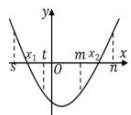
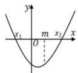
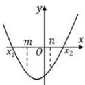
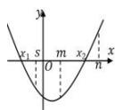

## 2. 两根分布在不同区间的控制条件：

<table><tr><td>图像</td><td></td><td></td><td></td><td></td></tr><tr><td>区间</td><td> $x_{1} \in (s,t)$  $x_{2} \in (m,n)$ </td><td> $x_{1} < m$  $x_{2} >m$ </td><td> $x_{1} < m$  $x_{2} >n$ </td><td> $x_{1} < s$  $m < x_{2} < n$ </td></tr><tr><td>控制条件</td><td> $\begin{cases} f(s)>0, \\ f(t)<0, \\ f(m)<0, \\ f(n)>0. \end{cases}$ </td><td> $f(m)<0$ </td><td> $\begin{cases} f(m)<0, \\ f(n)<0. \end{cases}$ </td><td> $\begin{cases} f(s)<0 \\ f(m)<0 \\ f(n)>0 \end{cases}$ </td></tr><tr><td>总结</td><td colspan="4">两零点分布在不同区间:只需要考虑区间端点值.</td></tr></table>

![[高中/课堂同步/题库/高中数学全练一本通/指数与对数函数/05_第六节_函数的零点及存在定理/____重点题型专练/2__两根分布在不同区间的控制条件_/questions/Q00010516.md]]
![[高中/课堂同步/题库/高中数学全练一本通/指数与对数函数/05_第六节_函数的零点及存在定理/____重点题型专练/2__两根分布在不同区间的控制条件_/questions/Q00010517.md]]
![[高中/课堂同步/题库/高中数学全练一本通/指数与对数函数/05_第六节_函数的零点及存在定理/____重点题型专练/2__两根分布在不同区间的控制条件_/questions/Q00010518.md]]
![[高中/课堂同步/题库/高中数学全练一本通/指数与对数函数/05_第六节_函数的零点及存在定理/____重点题型专练/2__两根分布在不同区间的控制条件_/questions/Q00010519.md]]
![[高中/课堂同步/题库/高中数学全练一本通/指数与对数函数/05_第六节_函数的零点及存在定理/____重点题型专练/2__两根分布在不同区间的控制条件_/questions/Q00010520.md]]
![[高中/课堂同步/题库/高中数学全练一本通/指数与对数函数/05_第六节_函数的零点及存在定理/____重点题型专练/2__两根分布在不同区间的控制条件_/questions/Q00010521.md]]
