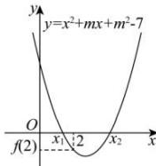

> [!faq]- 全练一本通解析
>
> > [!success]- **【答案】** B
>
> > [!note]- **【分析】**
> > 本题未单列分析。
>
> > [!note]- **【解析】**
> > 【详解】如下图所示：
> > 
> > 不妨设函数 $y=x^{2}+mx+m^{2}-7$ 的两个零点分别为 $x_{1},x_{2},\left(x_{1}<x_{2}\right)$ ，由于抛物线开口向上，2 为区间端点值，且零点分布在不同的两个区间所以由题意有 $f(2)=4+2m+m^{2}-7<0$ ，
> > $$
> > m ^ {2} + 2 m - 3 <   0
> > $$
> > 解得 -3 < m < 1，即实数 m 的取值范围是 $(-3, 1)$ .
> >
> > 故选 **B**.
