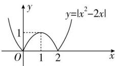

> [!faq]- 全练一本通解析
>
> > [!success]- **【答案】** 答案见解析
>
> > [!note]- **【分析】**
> > 本题未单列分析。
>
> > [!note]- **【解析】**
> > 函数 $y=\left|x^{2}-2x\right|$ 的图象如图所示.
> > 
> > （1）函数 $f(x)$ 没有零点，即函数 $y = a$ 与 $y = \left|x^{2} - 2x\right|$ 的图象没有交点，观察图象可知，此时 $a < 0$ ：
> > （2）函数 $f(x)$ 有两个零点，即函数 y=a 与 $y=\left|x^{2}-2x\right|$ 的图象有两个交点，观察图象可知此时 a=0 或 a>1。
> > （3）函数 $f(x)$ 有三个零点，即函数 y=a 与 $y=\left|x^{2}-2x\right|$ 的图象有三个交点，由图象易知 a=1。
> > （4）函数 $f(x)$ 有四个零点, 即函数 y=a 与 $y=\left|x^{2}-2x\right|$ 的图象有四个交点, 由图象易知 0<a<1.
