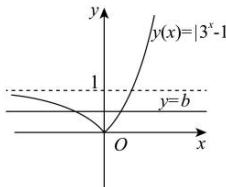

> [!faq]- 全练一本通解析
>
> > [!success]- **【答案】** (0,1)
>
> > [!note]- **【分析】**
> > 本题未单列分析。
>
> > [!note]- **【解析】**
> > 函数 $f(x)=\left|3^{x}-1\right|-b$ 有两个零点，
> > 即为函数 $f(x) = \left|3^x - 1\right|$ 的图象与直线 $y = b$ 的图象有两个交点，
> > 
> > 可得 0 < b < 1.
