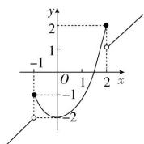
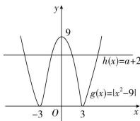

> [!faq]- 全练一本通解析
>
> > [!success]- **【答案】** BCD
>
> > [!note]- **【分析】**
> > 本题未单列分析。
>
> > [!note]- **【解析】**
> > 解析: 令 $(x^{2}-2)-(x-1)\leqslant1$ ，得 $-1\leqslant x\leqslant2$ ，则 $f(x)=\left\{\begin{aligned}x^{2}-2,-1\leqslant x\leqslant2,\\ x-1,x<-1\text{或}x>2\end{aligned}\right.$ 函数 y = f(x) - c 的图象与 x 轴恰有两个公共点，即函数 $f(x)$ 的图象与直线 y = c 恰有两个公共点，
> > 
> > ∴ 画出函数 $f(x)$ 的图象（如图）可得，实数 c 的取值范围是 $(-2, -1] \cup (1, 2]$ .
> > 解析： $g(x)=\left|x^{2}-9\right|,h(x)=a+2$ ，在同一平面直角坐标系内画出两个函数的图象，如图所示。由图可知，当 $a+2>9$ ，即a>7时，两函数图象有2个交点，即函数 $f(x)$ 有2个零点；当 $a+2=9$ ，即a=7时，两函数图象有3个交点，即函数 $f(x)$ 有3个零点；当 $0<a+2<9$ ，即-2<a<7时，两函数图象有4个交点，即函数 $f(x)$ 有4个零点；当 $a+2=0$ ，即a=-2时，两函数图象有2个交点，即函数 $f(x)$ 有2个零点；当 $a+2<0$ ，即a<-2时，两函数图象没有交点，即函数 $f(x)$ 没有零点。综上可知，函数 $f(x)$ 的零点个数可能为0,2,3,4。故选BCD.
> > 
