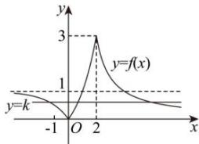

> [!faq]- 全练一本通解析
>
> > [!success]- **【答案】** B
>
> > [!note]- **【分析】**
> > 本题未单列分析。
>
> > [!note]- **【解析】**
> > 解析: 将 $y=2^{x}$ 的图象向下平移 1 个单位得到 $y=2^{x}-1$ ，再将 $y=2^{x}-1$ 的图象的 x 轴下方的图象以 x 轴为对称轴翻转至 x 轴上方可得到 $y=|2^{x}-1|$ ,
> > 将 $y=\frac{3}{x}$ 的图象向右平移 1 个单位得到 $y=\frac{3}{x-1}$ ,
> > 所以 $f(x)=\left\{\begin{aligned}&\left|2^{x}-1\right|, &x<2,\\&\frac{3}{x-1}, &x\geq2,\end{aligned}\right.$ 的图象如图所示，
> > 
> > 由图可知，当 $0 < k < 1$ 时，函数 $y = f(x)$ 与 $y = k$ 图象有且仅有三个不同的交点.
> >
> > 故选 **B**.
