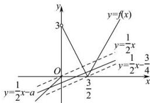

> [!faq]- 全练一本通解析
>
> > [!success]- **【答案】** $[0, \frac{3}{4})$ .
>
> > [!note]- **【分析】**
> > 本题未单列分析。
>
> > [!note]- **【解析】**
> > 由 $g(x) = f(x) - \frac{1}{2} x + a$ 存在3个零点，即方程 $f(x) - \frac{1}{2} x + a = 0$ 有3个实数根，即函数 $y = f(x)$ 与 $y = \frac{1}{2} x - a$ 的图象有3个不同的交点，因为函数 $f(x) = \begin{cases} x, & x \leq 0 \\ |2x - 3|, & x > 0 \end{cases}$ ，画出函数 $y = f(x)$ 和 $y = \frac{1}{2} x - a$ 的图象，如图所示，结合图象，将点 $(\frac{3}{2}, 0)$ 代入 $y = \frac{1}{2} x - a$ ，可得 $a = \frac{3}{4}$ ，此时 $y = \frac{1}{2} x - \frac{3}{4}$ ，要使得函数 $y = f(x)$ 和 $y = \frac{1}{2} x - a$ 的图象有3个不同的交点，则满足 $-\frac{3}{4} < -a \leq 0$ ，解得 $0 \leq a < \frac{3}{4}$ ，即实数 $a$ 的取值范围是 $[0, \frac{3}{4})$ .
> > 
