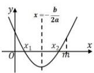
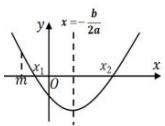
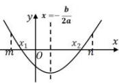

## 题型 4:二次函数的零点分布问题

1. 两零点分布在相同区间的控制条件：

<table><tr><td>图像</td><td></td><td></td><td></td></tr><tr><td>区间</td><td> $x_{1},x_{2}\in(-\infty,m)$ </td><td> $x_{1},x_{2}\in(m,+\infty)$ </td><td> $x_{1},x_{2}\in(m,n)$ </td></tr><tr><td>控制条件</td><td> $\begin{cases}\Delta\geq0\\-\frac{b}{2a}mf(m)>0\end{cases}$ </td><td> $\begin{cases}\Delta\geq0\\-\frac{b}{2a}>mf(m)>0\end{cases}$ </td><td> $\begin{cases}\Delta\geq0\\m<-\frac{b}{2a}f(m)>0f(n)>0\end{cases}$ </td></tr><tr><td>总结</td><td colspan="3">两零点在同一区间:需要考虑3种控制条件,一是判别式,二是对称轴,三是区间端点值</td></tr></table>
