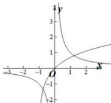

> [!faq]- 全练一本通解析
>
> > [!success]- **【答案】** C
>
> > [!note]- **【分析】**
> > 本题未单列分析。
>
> > [!note]- **【解析】**
> > 解析:由题函数 $f(x)=\ln(x+1)-\frac{1}{x}$ 在定义域内的零点个数即为 $y=\ln(x+1)$ 与 $y=\frac{1}{x}$ 的交点个数.画出 $y=\ln(x+1)$ 与 $y=\frac{1}{x}$ 的图像有
> > 
> > 易得有两个交点.
> >
> > 故选 **C**
