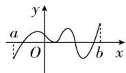
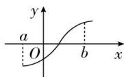
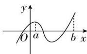

## 3. 函数零点存在定理

如果函数 $y = f(x)$ 在区间 $[a, b]$ 上的图象是一条连续不断的曲线，且有 $f(a)f(b) < 0$ ，那么，函数 $y = f(x)$ 在区间 $(a, b)$ 内至少有一个零点，即存在 $c \in (a, b)$ ，使得 $f(c) = 0$ ，这个 c 也就是方程 $f(x) = 0$ 的解.

（1）此判定定理只能判断出零点的存在性, 而不能判断出零点的个数. 如图①②, 虽然都有 $f(a)f(b)<0$ , 但图①中有 4 个零点, 而图②中仅有 1 个零点.

（2）此判定定理是不可逆的, 因为 $f(a)f(b)<0 \Rightarrow$ 函数 $y=f(x)$ 在区间 $(a,b)$ 内存在零点. 但是已知函数 $y=f(x)$ 在区间 $(a,b)$ 内存在零点不一定推出 $f(a)f(b)<0$ . 如图③, 在区间 $(a,b)$ 内函数有零点, 但 $f(a)f(b)>0$ .

①

②

③
