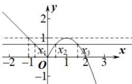

> [!faq]- 全练一本通解析
>
> > [!success]- **【答案】** (1,2)
>
> > [!note]- **【分析】**
> > 本题未单列分析。
>
> > [!note]- **【解析】**
> > 画出 $f(x)$ 的图象, 易得 $x_{2} + x_{3} = 2 \times 1 = 2$ , 且当 x > 0 时, $f(x)$ 的最大值为 $f(1) = 1$ , 当 x < 0 时 $f(x) = 1$ 解得 x = -1, 故 $x_{1} \in (-1, 0)$ , 故 $x_{1} + x_{2} + x_{3} = 2 + x_{1} \in (1, 2)$
> > 
> > 故答案为: $(1,2)$
