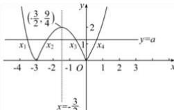
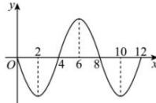

> [!faq]- 全练一本通解析
>
> > [!success]- **【答案】** -6
>
> > [!note]- **【分析】**
> > 本题未单列分析。
>
> > [!note]- **【解析】**
> > 在同一个直角坐标系内分别作出 $y=f(x)=|x^{2}+3x|$ 与 y=a 的图象, 如图所示
> > 
> > 不妨设 $x_{1}<x_{2}<x_{3}<x_{4}$ ，由图象 $y=f(x)$ 的对称性可知： $x_{1}+x_{4}=-3, x_{2}+x_{3}=-3$ ，所以 $x_{1}+x_{2}+x_{3}+x_{4}=-6$ .
> > 解析:由 $f(x+2)$ 为偶函数, 则 $f(-x+2)=f(x+2)$ , 故 $f(-x)=f(x+4)$ ,
> > 又 $f(x)$ 是定义在 R 上的奇函数, 则 $f(x) = -f(-x)$ ,
> > $$
> > f (x) = - f (x + 4)
> > $$
> > $$
> > f (x + 4) = - f (x + 8)
> > $$
> > $$
> > f (x) = f (x + 8)
> > $$
> > $$
> > x = 2
> > $$
> > 由 $f(x)$ 在 $[0,2]$ 上单调递减，结合上述分析知：在 $[2,6]$ 上递增， $[6,10]$ 上递减， $[10,12]$ 上递增，
> > 所以 $f(x)$ 在 $[0,12]$ 的大致草图如下：
> > 
> > 要使 $f(x) = m$ 在 $[0,12]$ 上恰好有4个不同的实数根，即 $f(x)$ 与 $y = m$ 有4个交点，所以，必有两对交点分别关于 $x = 2, x = 10$ 对称，则 $x_{1} + x_{2} + x_{3} + x_{4} = 24$ . 故答案为：24
