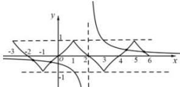

> [!faq]- 全练一本通解析
>
> > [!success]- **【答案】** 8
>
> > [!note]- **【分析】**
> > 本题未单列分析。
>
> > [!note]- **【解析】**
> > 因为 $f(x)$ 是定义在 R 上的奇函数, 所以 $f(-x) = -f(x)$ ,解析: 因为 $f(x)$ 是定义在 R 上的奇函数, 所以 $f(-x) = -f(x)$ ,
> > 由题意得, $f(x+2)=-f(x)$ , $\therefore f(x+4)=-f(x+2)=f(x)$ , 即 $f(x)$ 周期为 4. $\because f(x+2)=f(-x),\therefore f(x)$ 的图象关于 x=1 对称. 作出 $f(x)$ 大致图象如图所示,
> > 
> > 则 $g(x)=(x-2)f(x)-1$ 的零点即为 $y=f(x)$ 图象与 $y=\frac{1}{x-2}$ 图象的交点的横坐标, 四个交点分别关于点 $(2,0)$ 对称, 则 $x_{1}+x_{4}=4$ , $x_{2}+x_{3}=4$ , 即零点之和为 8.
> > 故答案为:8.
