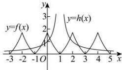

> [!faq]- 全练一本通解析
>
> > [!success]- **【答案】** D
>
> > [!note]- **【分析】**
> > 本题未单列分析。
>
> > [!note]- **【解析】**
> > 解析：∵ $f(2-x)=f(x)$ ，∴ $f(x)$ 的图象关于直线 x=1 对称，
> > 令 $h(x)=\frac{1}{|x-1|}$ ，则 $h(x)$ 的图象关于直线 x=1 对称，
> > 作出函数 $f(x), h(x)$ 在区间 $[-3,5]$ 的图象，
> > 
> > 由图可知， $h(x)$ 与 $f(x)$ 的图象在区间 $[-3,5]$ 上共有8个交点，且两函数关于直线 $x = 1$ 对称，所以方程 $f(x) = \frac{1}{|x - 1|}$ 在区间 $[-3,5]$ 所有解的和为 $4\times 2 = 8$ .
> >
> > 故选 **D**.
