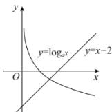

> [!faq]- 全练一本通解析
>
> > [!success]- **【答案】** B
>
> > [!note]- **【分析】**
> > 本题未单列分析。
>
> > [!note]- **【解析】**
> > 1
> > 解析: 在同一直角坐标系中画出函数 $y = \log_{a} x, (0 < a < 1)$ 和 y = x - 2 的图象,
> > 由图象可知:两个函数图象只有一个交点, 故方程 $\log_{a}x=x-2(0<a<1)$ 的实数解的个数为 1，故选:B
> > 
