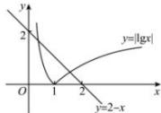

> [!faq]- 全练一本通解析
>
> > [!success]- **【答案】** 2
>
> > [!note]- **【分析】**
> > 本题未单列分析。
>
> > [!note]- **【解析】**
> > 由 $\left|\lg x\right|+x-2=0$ 得 $\left|\lg x\right|=2-x$ ，在同一平面直角坐标系内作出 $y=\left|\lg x\right|$ 与 y=2-x 的图象，
> > 
> > 两个函数的图象有两个交点, 所以方程有两个解.
