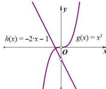

> [!faq]- 全练一本通解析
>
> > [!success]- **【答案】** 1
>
> > [!note]- **【分析】**
> > 本题未单列分析。
>
> > [!note]- **【解析】**
> > 由 $f(x)=x^{2}+\frac{1}{x}+2=0$ 得 $x^{3}+2x+1=0$ 即 $x^{3}=-2x-1$ ，令 $g(x)=x^{3}(x\neq0)$ ， $h(x)=-2x-1(x\neq0)$ ，
> > 
> > 由图象可知两个函数仅有一个交点, 所以函数 $f(x)$ 仅有一个零点, 故答案为: 1.
