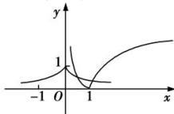

> [!faq]- 全练一本通解析
>
> > [!success]- **【答案】** 2
>
> > [!note]- **【分析】**
> > 本题未单列分析。
>
> > [!note]- **【解析】**
> > 函数 $y = a^{|x|} - \left|\log_{a} x\right|$ 的零点的个数即为方程 $a^{|x|} = \left|\log_{a} x\right|$ 的解的个数, 也就是函数 $f(x) = a^{|x|} (0 < a < 1)$ 与 $g(x) = \left|\log_{a} x\right| (0 < a < 1)$ 的图象的交点的个数.
> > 画出函数图象如下图所示：
> > 
> > 观察可得函数 $f(x)=a^{|x|}(0<a<1)$ 与 $g(x)=\left|\log_{a}x\right|(0<a<1)$ 的图象的交点的个数为 2，从而函数 $y=a^{|x|}-\left|\log_{a}x\right|$ 的零点的个数为 2.
