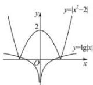

> [!faq]- 全练一本通解析
>
> > [!success]- **【答案】** 4
>
> > [!note]- **【分析】**
> > 本题未单列分析。
>
> > [!note]- **【解析】**
> > 本题转化为函数 $y=\lg|x|$ 和函数 $y=\left|x^{2}-2\right|$ 的交点个数, 做出两个函数的图像, 如图,
> > 
> > 根据图像可得两个函数交点的个数为4个, 所以函数 $f(x)=\lg|x|-\left|x^{2}-2\right|$ 的零点个数为4个.
