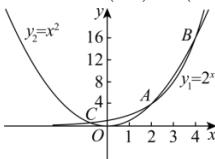

> [!faq]- 全练一本通解析
>
> > [!success]- **【答案】** 3
>
> > [!note]- **【分析】**
> > 本题未单列分析。
>
> > [!note]- **【解析】**
> > 由题意可知:
> > 要研究函数 $f(x)=x^{2}-2^{x}$ 的零点个数,
> > 只需研究函数 $y=2^{x}$ , $y=x^{2}$ 的图像交点个数即可.
> > 画出函数 $y_{1}=2^{x}$ , $y_{2}=x^{2}$ 的图像,
> > 因为 x=1 时， $y_{1}>y_{2}$ ，x=3 时， $y_{1}<y_{2}$ ,
> > x=5 时， $y_{1}>y_{2}$ 可知当1<x<3 和 3<x<5 时，图像各有一个交点，
> > x<0 时，必有一个交点，
> > 只交点为 $4(2,4)$ 。 $P(4,16)$ 及第二象限的点 C
> > 且交点为 $A(2,4)$ ， $B(4,16)$ 及第二象限的点 $C$ .
> > 
