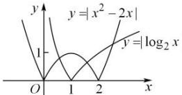

> [!faq]- 全练一本通解析
>
> > [!success]- **【答案】** 3
>
> > [!note]- **【分析】**
> > 本题未单列分析。
>
> > [!note]- **【解析】**
> > 由题意, $f(x)=\left|x^{2}-2x\right|-\left|\log_{2}x\right|=0\Leftrightarrow\left|x^{2}-2x\right|=\left|\log_{2}x\right|$ 即函数 $f(x)=\left|x^{2}-2x\right|-\left|\log_{2}x\right|$ 的零点的个数即为 $y=\left|x^{2}-2x\right|$ , $y=\left|\log_{2}x\right|$ 的交点的个数，在同一直角坐标系中画出两个函数图像
> > 
> > 数形结合可知, 两个函数有 3 个交点, 故函数 $f(x) = \left|x^{2} - 2x\right| - \left|\log_{2}x\right|$ 的零点的个数是 3 , 故答案为: 3
