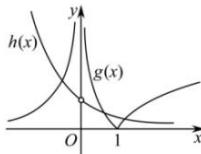
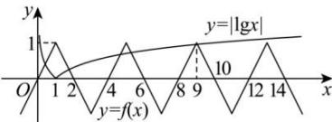

> [!faq]- 全练一本通解析
>
> > [!success]- **【答案】** 3
>
> > [!note]- **【分析】**
> > 本题未单列分析。
>
> > [!note]- **【解析】**
> > 由题知 $f(x)$ 的零点个数等于函数 $g(x)=\left\{\begin{aligned}-\frac{1}{x},&x<0\\|\log_{5}x|,&x>0\end{aligned}\right.$ 与 $h(x)=\left(\frac{1}{2}\right)^{x},(x\neq0)$ 图象交点个数,如图,作出函数 $g(x)=\left\{\begin{aligned}-\frac{1}{x},&x<0\\|\log_{5}x|,&x>0\end{aligned}\right.$ 与 $h(x)=\left(\frac{1}{2}\right)^{x},(x\neq0)$ 的图象,
> > 
> > 由图象可知 $g(x)$ 与 $h(x)$ 的图象有 3 个交点, 即 $f(x)$ 的零点个数为 3, 故答案为: 3
> > 解析: 函数 $g(x)$ 的零点个数等价于函数 $f(x)$ 与 $h(x)=|\lg x|$ 的图象交点个数，
> > 当 x>2 时， $f(x)=-f(x-2)$ ，
> > 所以 $f(x+4)=-f(x+2)=f(x)$ ，
> > 所以当 x>2 时， $f(x)$ 是周期为 4 的函数；
> > 当 $x \leq 2$ 时， $f(x) = 1 - |x - 1| = \begin{cases} 2 - x, & 1 \leq x \leq 2 \\ x, & x < 1 \end{cases}$ ;
> > 所以 $f(x)$ 的图象如图所示，
> > 在同一坐标系下画出 $h(x)=|\lg x|$ 的图象，
> > 因为 $0 < \lg 9 < 1$ ，所以两函数有6个交点，即函数 $g(x)$ 有6个零点.
> > 故答案为：6.
> > 
