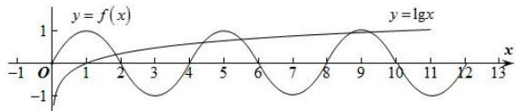

> [!faq]- 全练一本通解析
>
> > [!success]- **【答案】** 5
>
> > [!note]- **【分析】**
> > 本题未单列分析。
>
> > [!note]- **【解析】**
> > 因为对任意实数 x，恒有 $f(x+2)=-f(x)$ ，
> > 所以 $f(x+4)=-f(x+2)=f(x)$ ，所以 $f(x)$ 是周期为 4 的周期函数，
> > 当 $x \in [-2,0]$ 时， $-x \in [0,2]$ 时， $f(-x)=2\cdot(-x)-(-x)^{2}=-2x-x^{2}$ 又因为 $f(x)$ 是定义在 R 上的奇函数，
> > 所以 $f(-x) = -f(x) = -2x - x^{2}$ ，可得 $f(x) = 2x + x^{2}$ 当 $x \in [2,4]$ 时， $x - 4 \in [-2,0]$ ，
> > 所以 $f(x-4)=2(x-4)+(x-4)^{2}=x^{2}-6x+8$ 因为 $f(x)$ 是周期为 4 的周期函数，
> > 所以 $f(x)=x^{2}-6x+8,\quad x\in[2,4]$ 方程 $f(x)-\lg x=0$ 的根的个数即为 $f(x)$ 的图象以及 $y=\lg x$ 的图象交点的个数，
> > 根据周期性作出 $f(x)$ 的图象的图象以及 $y=\lg x$ 的图象，如图：
> > 
> > 当 x>10 时， $y=\lg x>1$ ，而 $f(x)_{\max}=1$ ，所以 x>10 时，两个函数图象无交点，
> > 由图知： $f(x)$ 的图象与 $y=\lg x$ 的图象有 5 个交点，
> > 所以方程 $f(x)-\lg x=0$ 的根的个数为 5.
