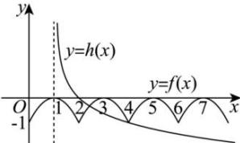

> [!faq]- 全练一本通解析
>
> > [!success]- **【答案】** C
>
> > [!note]- **【分析】**
> > 本题未单列分析。
>
> > [!note]- **【解析】**
> > 解析:由题意知， $f(2-x)=f(x)=f(-x)$
> > 所以 $f(x+2)=f(x)$ ，所以函数的周期为 2，
> > 由 $g(x) = f(x) - \log_{\frac{1}{2}}(|x| - 1) = 0$ 可得 $f(x) = \log_{\frac{1}{2}}(|x| - 1)$
> > 所以将函数 $g(x)$ 的零点个数转化为函数 $f(x)$ 的图象与
> > $h(x)=\log_{\frac{1}{3}}\left(\left|x\right|-1\right)$ 的图象交点个数，对于 $h(x)=\log_{\frac{1}{3}}\left(\left|x\right|-1\right)$ ，定义域为 $(-∞,-1)\cup(1,+∞)$ ，
> > 因为 $h(-x) = h(x)$ ，所以 $h(x) = \log_{\frac{1}{2}}(|x| - 1)$ 为偶函数，
> > 所以作出 $f(x)$ 和 $h(x)$ 在 $y$ 轴右侧的图象如图所示，
> > 
> > 由图象可知有 2 个交点，
> > 所以 $f(x)$ 的图象与 $h(x)=\log_{\frac{1}{3}}\left(\left|x\right|-1\right)$ 的图象交点个数为 4,
> > 即 $g(x) = f(x) - \log_{\frac{1}{2}}(|x| - 1)$ 的零点个数为4．
> >
> > 故选 **C**
