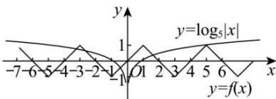
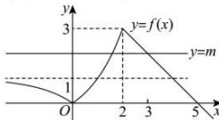
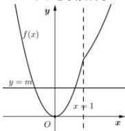

> [!faq]- 全练一本通解析
>
> > [!success]- **【答案】** BCD
>
> > [!note]- **【分析】**
> > 本题未单列分析。
>
> > [!note]- **【解析】**
> > 5
> > 解析: 因为 $f(x+2)=-f(x)$ ,
> > 所以 $f(x+4)=-f(x+2)=f(x)$ ，可得函数 $y=f(x)$ 是周期为 4 的奇函数，
> > 因为 $f(x+2)=-f(x)=f(-x)$ ，可得 $y=f(x)$ 的图象关于直线 x=1 对称。当 $0<x\leq1$ 时， $f(x)=x$ ，又易知 $f(0)=0$ ，所以 $-1\leq x\leq1$ 时， $f(x)=x$ ，
> > 由对称性可先画出函数 $y=f(x)$ 在区间 [1,3] 上的图象，
> > 根据函数 $y=f(x)$ 为奇函数且周期为 4，可以画出函数 $y=f(x)$ 在 R 上的图象，
> > 由 $y=f(x)-\log_{5}|x|=0$ ，得 $f(x)=\log_{5}|x|$ 分别画出函数 $y=f(x)$ 和 $y=\log_{5}|x|$ 的图象，如图，
> > 
> > 由 $f(5) = f(1) = 1$ ，又 $\log_55 = 1, f(-3) = f(1) = 1, \log_5 |-3| = \log_53 < 1$
> > $$
> > f (- 7) = f (1) = 1
> > $$
> > $$
> > \log_ {5} | - 7 | = \log_ {5} 7 > 1
> > $$
> > 可以得到函数 $y = f(x)$ 和 $y = \log_{5}|x|$ 的图象有 5 个交点，所以函数 $y = f(x) - \log_{5}|x|$ 零点的个数为 5. 故答案为：5.
> > 解析: 因为关于 x 的方程 $f(x) - m = 0$ 恰有两个不同的实数解,
> > 所以函数 $y=f(x)$ 的图象与直线 y=m 的图象有两个交点,作出函数图象,如下图所示,
> > 
> > $$
> > m \in [ 1, 3) \cup \{0 \}
> > $$
> > $$
> > y = f (x)
> > $$
> > $$
> > y = m
> > $$
> > $$
> > [ 1, 3) \cup \{0 \}
> > $$
> > 四个选项中只要是 $[1,3) \cup \{0\}$ 的子集就满足要求. 故选: BCD.
> > 解析:由函数解析式, $f(x)$ 在 $(-\infty,0]$ 上递减, $(0,1)$ 、 $[1,+\infty)$ 上递增, 且在 x=1 处连续, 所以 $f(x)$ 大致图象如下,
> > 
> > 由函数 $y = f(x) - m$ 仅有一个零点, 即 $f(x)$ 与 y = m 仅有一个交点, 由图知: m = 0. 故答案为: 0
