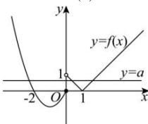

> [!faq]- 全练一本通解析
>
> > [!success]- **【答案】** } \quad 2; [ 0, 1) $$
>
> > [!note]- **【分析】**
> > 本题未单列分析。
>
> > [!note]- **【解析】**
> > 因为 $f(x)=\left\{\begin{aligned} &\left|x-1\right|,&x>0\\ &x^{2}+2x,&x\leq0\end{aligned}\right.$
> > 所以 $f(-3)=(-3)^{2}-6=3$
> > 所以 $f(f(-3))=f(3)=2$ ;
> > 画出函数 $f(x)$ 的图象,
> > 
> > 方程 $f(x)=a$ 有且仅有3个不同的根即 $y=f(x)$ 与 y=a 的图象有3个交点，由图可得： $0 \leq a < 1$ . 故答案为：2； $[0,1)$ .
