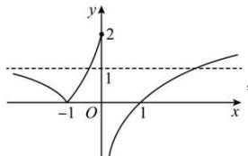

> [!faq]- 全练一本通解析
>
> > [!success]- **【答案】** $\left(1,\frac{7}{6}\right]$
>
> > [!note]- **【分析】**
> > 本题未单列分析。
>
> > [!note]- **【解析】**
> > 函数 $f(x)=x^{2}-2(a+1)x+4$ 在区间 $\left[\frac{1}{2},3\right]$ 上有两个零点,
> > 即 $x^{2}-2(a+1)x+4=0$ 在区间 $\left[\frac{1}{2},3\right]$ 上有两个不同的解，
> > 即 $2(a+1)=x+\frac{4}{x}$ 在区间 $\left[\frac{1}{2},3\right]$ 上有两个不同的解，
> > 转化成 $y=2(a+1)$ 与 $f(x)=x+\frac{4}{x}$ 在区间 $\left[\frac{1}{2},3\right]$ 上有两个不同的交点，
> > 结合对勾函数的性质可知 $f(x)=x+\frac{4}{x}$ 在 $\left[\frac{1}{2},2\right]$ 单调递减，在 $[2,3]$ 单调递增，
> > 且 $f\left(\frac{1}{2}\right)=\frac{17}{2},f(2)=4,f(3)=\frac{13}{3}$ ，所以 $4<2(a+1)\leq\frac{13}{3}$ ，解得 $1<a\leq\frac{7}{6}$ ，故答案为： $\left(1,\frac{7}{6}\right)$ .
> > $$
> > g (x) = f (x) - a = 0
> > $$
> > $$
> > f (x) = a
> > $$
> > $$
> > f (x) = \left\{ \begin{array}{l} \left| 3 ^ {x + 1} - 1 \right|, x \leq 0 \\ \ln x, x > 0 \end{array} \right.
> > $$
> > 
> > 根据图象易知当 0 < a < 1 时，函数 $y = f(x)$ 与函数 y = a 存在 3 个交点，即 $g(x) = 0$ 有 3 个零点。因此得： $a \in (0,1)$ 故答案为： $(0,1)$
