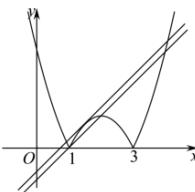

> [!faq]- 全练一本通解析
>
> > [!success]- **【答案】** $\left[-1,-\frac{3}{4}\right]$
>
> > [!note]- **【分析】**
> > 本题未单列分析。
>
> > [!note]- **【解析】**
> > 令 $f(x)=\left|x^{2}-4x+3\right|=0$ ，得两实根 $x_{1}=1,\quad x_{2}=3$ 所以 $f(x)=\left\{\begin{aligned}&x^{2}-4x+3,x<1,\\&-x^{2}+4x-3,1\leq x\leq2,\\&x^{2}-4x+3,x>1,\end{aligned}\right.$ 因为方程 $f(x)-a=x$ 至少有三个不相等的实数根，
> > 所以函数 $f(x)=\left|x^{2}-4x+3\right|$ 与函数 $g(x)=a+x$ 的图像至少有三个交点，
> > 在同一直角坐标系中，画出函数 $f(x)=\left|x^{2}-4x+3\right|$ 与函数 $g(x)=a+x$ 的图像，如图所示，
> > 
> > 图像要至少有三个交点, 则 $g(x) = a + x$ 的图像必须在如图所示的两条直线之间,
> > 这两条直线分别为函数 $g(x) = a + x$ 过点(1,0)时的图像和函数 $g(x) = a + x$ 的图像与函数 $f(x) = -x^2 + 4x - 3$ 的图像相切时的图像,
> > 当函数 $g(x) = a + x$ 的图像过点(1,0)时, $a = -1$ , 此时 $g(x) = a + x$ 与 $f(x) = |x^2 - 4x + 3|$ 的图像有三个交点,
> > 当函数 $g(x) = a + x$ 的图像与函数 $f(x) = -x^2 + 4x - 3$ 的图像相切时, 即方程 $-x^2 + 3x - 3 - a = 0$ 只有一个实数根,
> > 所以 $\Delta = 9 - 4(3 + a) = 0$ , 得 $a = -\frac{3}{4}$ , 此时 $g(x) = a + x$ 与 $f(x) = |x^2 - 4x + 3|$ 的图像有三个交点, 因此 $a$ 的取值范围是 $[-1, -\frac{3}{4}]$ . 故
> > 答案为: $\left[-1, -\frac{3}{4}\right]$
