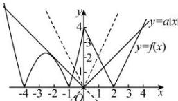
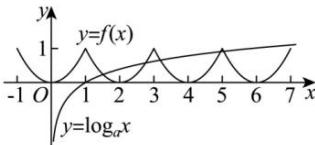

> [!faq]- 全练一本通解析
>
> > [!success]- **【答案】** AD
>
> > [!note]- **【分析】**
> > 本题未单列分析。
>
> > [!note]- **【解析】**
> > 解析: 由 $f(x) - a|x| = 0$ 得 $f(x) = a|x|$ , 作出函数 $y = f(x)$ , $y = a|x|$ 的图像, 如图所示.
> > 
> > $$
> > a = 0
> > $$
> > $$
> > a \geq 2
> > $$
> > $$
> > y = a | x |
> > $$
> > $$
> > y = f (x)
> > $$
> > $$
> > a \geq 2
> > $$
> > 解析:由题意知偶函数 $f(x)$ 满足 $f(x+1)=f(x-1)$ ，
> > 即 $f(x+2)=f(x)$ ，故2为函数的周期；
> > 因为函数 $g(x)=f(x)-\log_{a}|x|$ 为偶函数，所以方程 $f(x)=\log_{a}x$ 在 $(0,+\infty)$ 上有5个根，
> > 作出函数 $y=f(x)$ 在 $(0,+\infty)$ 上的图象，如图：
> > 
> > $$
> > \left\{ \begin{array}{l} a > 1 \\ \log_ {a} 5 <   1 \\ \log_ {a} 7 > 1 \end{array} \right.
> > $$
> > 故答案为：(5,7)
