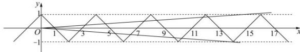
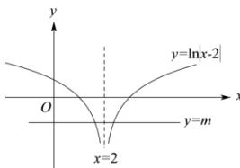

> [!faq]- 全练一本通解析
>
> > [!success]- **【答案】** (1)证明见解析；(2) $\left(\frac{1}{16},\frac{1}{12}\right)\cup\left\{-\frac{1}{14}\right\}$
>
> > [!note]- **【分析】**
> > 本题未单列分析。
>
> > [!note]- **【解析】**
> > （1）证明：因为 $f(x)$ 是 R 上的偶函数，所以 $f(-x)=f(x)$ 。
> > 因为 $f(x-2)+f(-x)=0$ ，所以 $f(-x)=f(x)=-f(x-2)$ ，
> > 则 $f(x+2)=-f(x)$ 。
> > 因为 $f(x+2)=f(x-2)$ ，所以 $f(x)=f(x+4)$ ，
> > 故函数 $f(x)$ 是周期函数，且周期为 4.
> > （2）解：当 $x\in[-2,0]$ 时， $x+2\in[0,2]$ ，则 $f(x+2)=1-(x+2)=-1-x$ ，
> > 由（1）知 $f(x)=-f(x+2)$ ，所以 $f(x)=x+1$ ，
> > 即当 $x\in[-2,0]$ 时， $f(x)=x+1$ 。
> > 因为函数 $g(x)$ 的零点个数就是函数 $f(x)$ 的图象与函数 $y=a|x|$ 的图象交点的个数，
> > 且函数 $f(x)$ 与函数 $y=a|x|$ 均为偶函数，所以当 x>0 时， $g(x)$ 恰有 7 个零点，
> > 即当 x>0 时，函数 $f(x)$ 的图象与函数 y=ax 的图象有 7 个交点。
> > 结合图象可知，
> > 
> > 当 $a > 0$ 时， $12a < 1 < 16a$ ，解得 $\frac{1}{16} < a < \frac{1}{12}$ ；
> > 当 $a < 0$ 时， $14a = -1$ ，解得 $a = -\frac{1}{14}$ 。
> > 综上可知，实数 $a$ 的取值范围是 $\left(\frac{1}{16}, \frac{1}{12}\right) \cup \left\{-\frac{1}{14}\right\}$ 。
> > 解析:由题意知: $x_{1}, x_{2}$ 是 $y = \ln |x - 2|$ 与 y = m 的两个交点的横坐标, 作出 $y = \ln |x - 2|$ 与 y = m 图象如下图所示,
> > 
> > 由图象可知： $x_{1},x_{2}$ 关于直线 $x = 2$ 对称， $\therefore x_1 + x_2 = 4$ ，故答案为：4.
