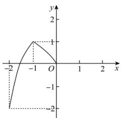
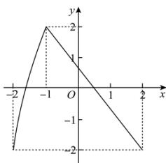

<!-- question-source:start -->
【39】（2022·河北石家庄高一）已知 $f(x)$ ， $g(x)$ 均是定义在 $[-2,2]$ 的函数，其中函数 $f(x)$ 是奇函数且 $f(x)$ 在 $[-2,0]$ 上的图象如图1，函数 $g(x)$ 在定义域上的图象如图2，则方程 $f[g(x)] = 0$ 的根的个数是（）

图1

图2

A. 3 B. 4 C. 5 D. 6
<!-- question-source:end -->

![[Q00010560A1]]
