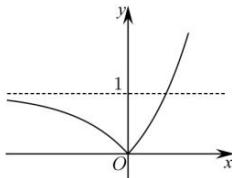
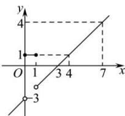

> [!faq]- 全练一本通解析
>
> > [!success]- **【答案】** (4,5)
>
> > [!note]- **【分析】**
> > 本题未单列分析。
>
> > [!note]- **【解析】**
> > 考虑方程 $\left|3^{x}-1\right|=t$ ，由 $f(x)=\left|3^{x}-1\right|$ 的图象得：
> > 
> > 当 $t < 0$ 时，方程 $\left|3^{x} - 1\right| = t$ 无解；当 $t = 0$ 或 $t \geq 1$ 时，方程 $\left|3^{x} - 1\right| = t$ 一解；当 $0 < t < 1$ ，方程 $\left|3^{x} - 1\right| = t$ 两解.
> > 故方程 $g(f(x)) = 0$ 有4个不相同的实数根，等价于方程 $g(x) = 0$ 在区间(0.1)上有两个不同实根，
> > 则 $\left\{\begin{aligned}\Delta &=a^{2}-16>0\\ 0&<\frac{a}{8}<1\end{aligned}\right.$ ，解得：4<a<5，所以实数 a 的取值范围为 $(4,5)$ . $g(1)=4-a+1>0$
> > $$
> > [ 0, 1 ] \cup [ 3, 4 ] \cup \{7 \}
> > $$
> > 解析: 令 $t = f(x)$ ，则所求函数的零点即为方程组 $\left\{\begin{aligned} t &= f(x)① \\ f(t) &= 1② \end{aligned}\right.$ 的解中的 x 值。由方程②: 作出函数 $y = f(x)$ 图象如下图所示，，
> > 观察图象, 由 $f(t)=1$ 可得 $t \in [0,1]$ 或 t=4 ,
> > 
> > 由方程①, 即 $f(x)=t$ , 结合图象可知:
> > 当 $t \in [0,1]$ 时， $f(x)=t$ 图象为介于 y=0 与 y=1 之间的区域，
> > 观察图象可知: 方程①的解为 $[0,1] \cup [3,4]$ ;
> > 当 t=4 时, 观察图象可知 x=7.
> > 故所求 x 的范围为 $[0,1] \cup [3,4] \cup \{7\}$ .
> > 故答案为： $[0,1] \cup [3,4] \cup \{7\}$
