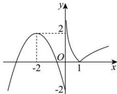

> [!faq]- 全练一本通解析
>
> > [!success]- **【答案】** B
>
> > [!note]- **【分析】**
> > 本题未单列分析。
>
> > [!note]- **【解析】**
> > 解析:作出函数 $f(x)$ 的图象如图所示,
> > 
> > 函数 $g(x)=3f^{2}(x)-(m+3)f(x)+m$ ，且 $g(x)$ 有 5 个零点，
> > 等价于 $(3f(x)-m)(f(x)-1)=0$ 有 5 个解，即 $f(x)=1$ 或 $f(x)=\frac{m}{3}$ 共有 5 个解，
> > 等价于 $y=f(x)$ 的图象与直线 y=1， $y=\frac{m}{3}$ 共有 5 个交点.
> > 由图得 $y=f(x)$ 的图象与直线 y=1 在 4 个交点，
> > 所以 $y=f(x)$ 的图象与直线 $y=\frac{m}{3}$ 有 1 个交点，则直线 $y=\frac{m}{3}$ 应位于直线 y=-2 下方，
> > 所以 $\frac{m}{3}<-2$ ，解得 m<-6，即实数 m 的取值范围是 $(-∞,-6)$ .
> >
> > 故选 **B**
